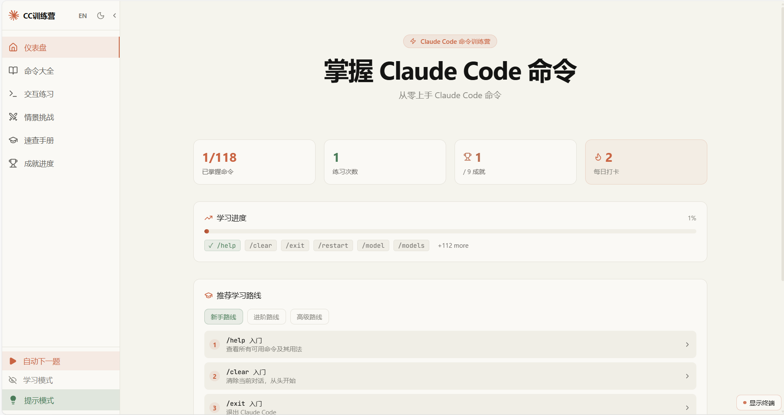
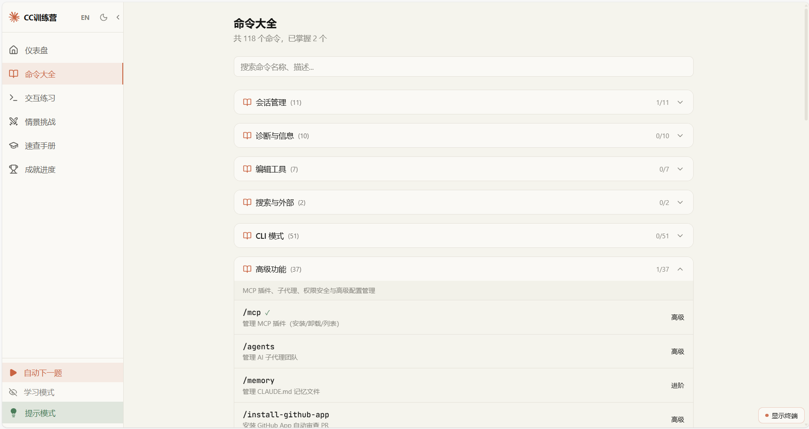
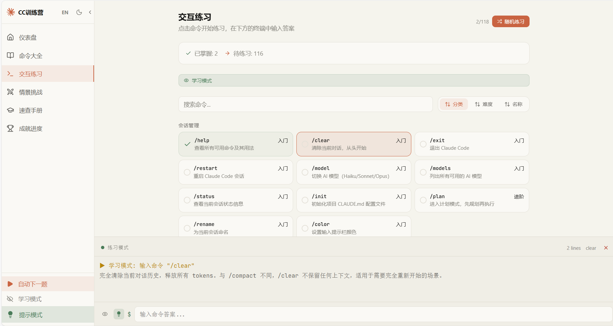
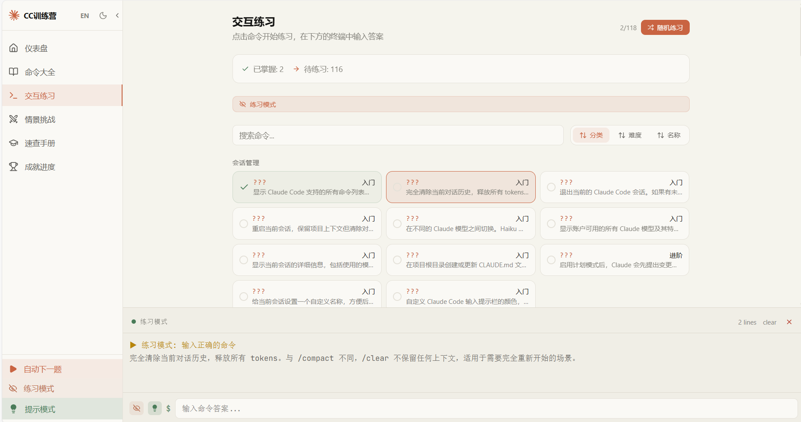
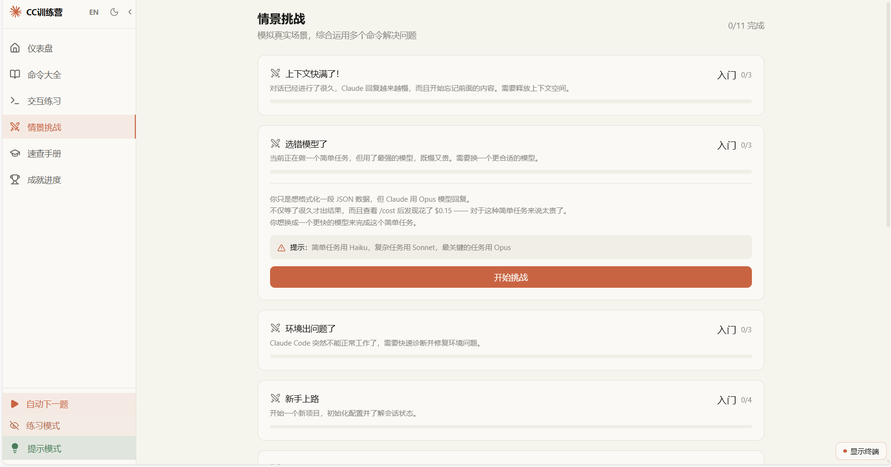
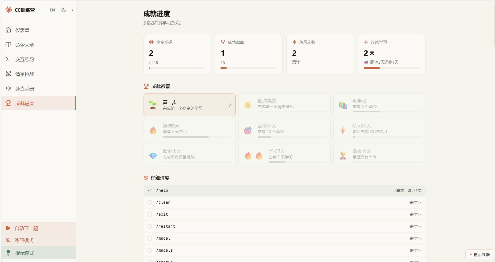
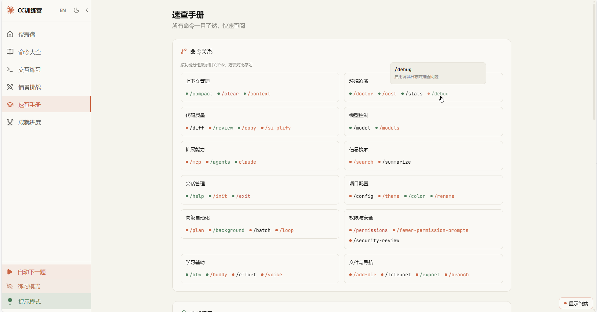

<p align="center">
  <b>🇨🇳 中文</b> &nbsp;|&nbsp; <a href="README.en.md">🇬🇧 English</a>
</p>

<p align="center">
  
</p>

<h1 align="center">🚀 Claude Code 命令训练营</h1>

<p align="center">
  <a href="https://claudelearn.top"></a>
  <a href="https://github.com/waw666waw666/claude-cmd-tutor"></a>
  <br>
  
  
  
  
  
</p>

---

**互动式 Claude Code 命令行学习平台。** 从零开始掌握全部 **118 个命令**，内置交互终端、情景挑战、成就系统，让 CLI 学习像打游戏一样有趣。

👉 **在线体验**: [claudelearn.top](https://claudelearn.top)

---

## 功能一览

| 功能 | 说明 |
|------|------|
| 📚 **命令大全** | 118 个命令按 6 大分类，搜索、难度标记、进度追踪 |
| ⌨️ **交互练习** | 内置模拟终端，选择→输入→验证，即时反馈 |
| ⚔️ **情景挑战** | 11 个真实开发场景，36 个任务步骤 |
| 📋 **速查手册** | 全量表格+悬停提示，快速定位命令 |
| 🏅 **成就进度** | 9 个徽章 + 学习统计 + 连续打卡（3天/7天） |
| 🔄 **自动下一题** | 答对后自动跳转，无缝练习 |
| 🧠 **回忆模式** | 隐藏命令名，根据描述回忆，强化记忆 |
| 💡 **命令提示** | 输入时自动补全，降低入门门槛 |
| 🌐 **中英双语** | 一键切换，界面+全部数据完整翻译 |
| 🌙 **暗色模式** | 亮/暗双主题自适应 |

---

## 📸 界面预览

<p align="center">
  
  <br>
  <em>命令大全 — 按分类浏览、搜索、追踪进度</em>
</p>

<p align="center">
  
  <br>
  <em>学习模式 — 查看命令详情、语法和示例</em>
</p>

<p align="center">
  
  <br>
  <em>练习模式 — 隐藏命令名，在终端中输入验证</em>
</p>

<p align="center">
  
  <br>
  <em>情景挑战 — 模拟真实问题场景，逐步解决</em>
</p>

<p align="center">
  
  <br>
  <em>成就进度 — 追踪学习成果和连续打卡</em>
</p>

<p align="center">
  
  <br>
  <em>速查手册 — 关联命令分组，悬停查看提示</em>
</p>

---

## 快速上手

```bash
npm install
npm run dev      # http://localhost:5173
npm run build    # 生产构建
```

---

## 技术栈

| 层 | 技术 |
|----|------|
| 框架 | Vite 8 + React 19 + TypeScript 6 |
| 样式 | Tailwind CSS v4 + CSS 变量 |
| 路由 | React Router v7（8 路由） |
| 状态 | Zustand + localStorage |
| 动画 | Framer Motion |
| 图标 | Lucide React |
| 国际化 | 自研 React Context |
| 部署 | Cloudflare Pages |

---

## 项目结构

```
src/
├── i18n/              # 翻译文件 (zh/en)
├── data/              # 118 命令, 11 场景, 9 成就
├── hooks/             # 本地化数据 hook
├── store/             # Zustand 进度存储
├── components/        # Layout, Sidebar, Terminal
├── pages/             # 8 个页面
├── App.tsx            # 路由
└── main.tsx           # 入口
```

---

## 开源协议

MIT

<p align="center">
  <a href="README.en.md"><b>🇬🇧 View in English</b></a>
</p>
