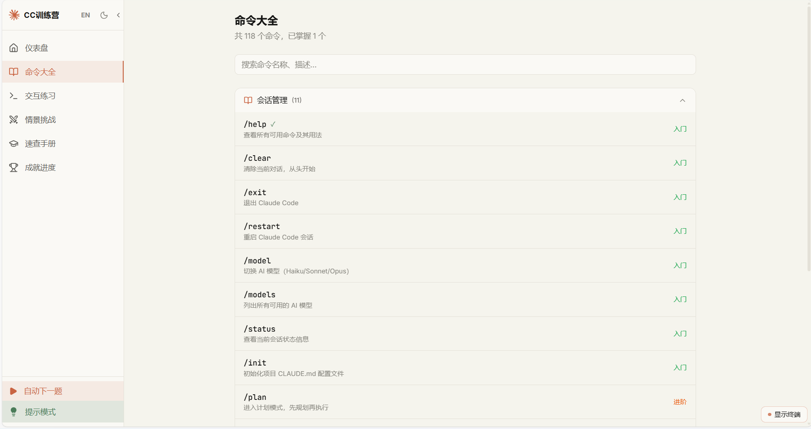

<p align="center">
  
</p>

<h1 align="center">🚀 Claude Code 命令训练营</h1>
<h3 align="center">Claude Code Command Bootcamp</h3>

<p align="center">
  <b>互动式命令行学习平台 · Interactive CLI Learning Platform</b>
</p>

<p align="center">
  <a href="https://claudelearn.top"></a>
  <a href="https://github.com/waw666waw666/claude-cmd-tutor"></a>
  <br>
  
  
  
  
  
</p>

---

## 📖 简介 · Introduction

**中文** | 从零开始，循序渐进地学习 Claude Code 全部 **118 个命令**。内置交互式终端、情景挑战、成就系统，让学习像打游戏一样有趣。

**English** | Learn all **118 Claude Code commands** from scratch with an interactive terminal, real-world scenarios, and gamified achievements. Make CLI learning fun.

<p align="center">
  
  <br>
  <em>English UI — Browse all 118 commands by category</em>
</p>

---

## ✨ 功能特性 · Features

| 中文 | English |
|------|---------|
| 📚 **命令大全** — 118 命令按 6 大分类，支持搜索/难度/进度 | 📚 **Commands** — 118 commands in 6 categories, search + difficulty + progress |
| ⌨️ **交互练习** — 内置模拟终端，即时反馈循环 | ⌨️ **Practice** — Built-in terminal emulator with instant feedback |
| ⚔️ **情景挑战** — 11 个真实开发场景，36 个任务步骤 | ⚔️ **Scenarios** — 11 real-world challenges, 36 task steps |
| 📋 **速查手册** — 全量表格，一键速览 | 📋 **Reference** — Full table for quick lookup |
| 🏅 **成就系统** — 9 个徽章 + 连续打卡追踪 | 🏅 **Achievements** — 9 badges + streak tracking |
| 🌐 **中英双语** — 一键切换，界面+数据完整翻译 | 🌐 **i18n** — One-click EN/ZH switch, UI + data fully translated |
| 🌙 **暗色模式** — 亮/暗双主题自适应 | 🌙 **Dark Mode** — Light/dark theme support |

<p align="center">
  
  <br>
  <em>Practice mode with interactive terminal — 练习模式与交互终端</em>
</p>

---

## 🚀 快速开始 · Quick Start

```bash
npm install
npm run dev        # http://localhost:5173
npm run build      # Production build
```

### 在线体验 · Live Demo

👉 **[claudelearn.top](https://claudelearn.top)** — 无需安装，打开即用 (Zero install, ready to go)

---

## 🛠️ 技术栈 · Tech Stack

| Layer | Tech |
|-------|------|
| Framework | Vite 8 + React 19 + TypeScript 6 |
| Styling | Tailwind CSS v4 + Dark mode CSS variables |
| Routing | React Router v7 (8 routes) |
| State | Zustand + localStorage persistence |
| Animation | Framer Motion |
| Icons | Lucide React |
| i18n | Custom React Context (EN/ZH) |
| Deployment | Cloudflare Pages |

---

## 📁 项目结构 · Structure

```
src/
├── i18n/              # Translations (zh/en)
├── data/              # 118 commands, 11 scenarios, 9 achievements
├── hooks/             # Localized data hooks
├── store/             # Zustand progress store
├── components/        # Layout, Sidebar, Terminal
├── pages/             # 8 pages (Home, Commands, Practice, etc.)
├── App.tsx            # Router
└── main.tsx           # Entry
```

---

## 📜 License

MIT
